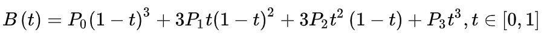
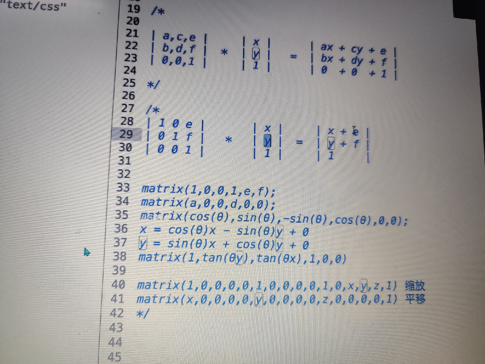

# [动画](http://css.doyoe.com/)
----------

## transition: 过渡

（过渡对象，持续时间，变化函数（可选），延迟时间（可选））

#### 变化函数：
贝塞尔曲线cubic-bezier(<number>, <number>, <number>, <number>)：特定的贝塞尔曲线类型，1,3数值需在[0, 1]区间内


输入的四个数为P1,P2的坐标点

## animations：动画
### 八个属性值：
- <' animation-name '>：
检索或设置对象所应用的动画名称
- <' animation-duration '>：
检索或设置对象动画的持续时间
- <' animation-timing-function '>：
检索或设置对象动画的过渡类型
- <' animation-delay '>：
检索或设置对象动画延迟的时间
- <' animation-iteration-count '>：
检索或设置对象动画的循环次数
- <' animation-direction '>：
检索或设置对象动画在循环中是否反向运动
- <' animation-fill-mode '>：
检索或设置对象动画时间之外的状态
- <' animation-play-state '>：
检索或设置对象动画的状态。

### 关键帧定义：
```
@keyframes 自定义名字{
数字%（执行时间占比其中0%可变为from ，100%可变为to){

}
```

- steps（步数，start/ end）
- start:保留下一帧状态，直到这一段动画时间结束
- end:保留当前帧状态，直到这一段动画时间结束，最后一帧可能看不到，可加上forwords来弥补

`steps(1,start) === step-start`
`steps(1,end) === step-end `

### scale:伸缩
可3d变化

伸缩的是此元素变化的坐标轴的刻度。可叠加操作  
scale的坐标轴会随着旋转轴的旋转而旋转，但会保留影响，设置过的会保留效果。

### skew:倾斜
2d变化  
倾斜的是此元素变化的坐标轴，还会拉伸坐标轴


可水平居中
```css
left:50%;
transform:translateX(-50%);
```


perspective：景深，我们视线距离浏览器的距离，只设置这一个并不会影响大小

transform-origin：旋转中心，可填三个值x , y, z


matrix:矩阵，transform的强大属性，可以完成各种变换




浏览器渲染过程


reflow:  
改变窗口大小  
改变文字大小  
内容的改变，输入框输入文字  
激活伪类，如:hover  
操作class属性  
脚本操作DOM  
计算offsetWidth和offsetHeight  
设置style属性  
repaint：  
repaint：如果只是改变某个元素的背景色、  
文 字颜色、边框颜色，不影响它周围或内部布局的属性
repaint  
repaint 速度快于 reflow  


像素里面有三个色点，三个在一个平面排列，里面每个像点代表三原色的每一个颜色，空间混色法